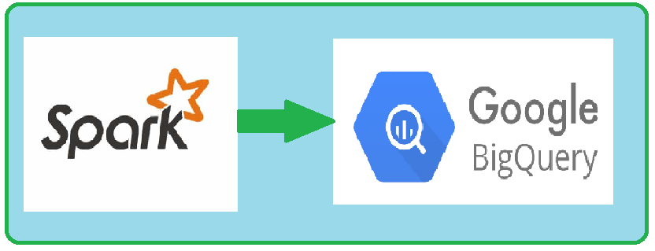

# Querying Google BigQuery Table via Spark

  

  

This README file provides instructions on how to query a BigQuery table from Apache Spark using the spark-bigquery library.

## Prerequisites

- 𝐬𝐩𝐚𝐫𝐤-𝐛𝐢𝐠𝐪𝐮𝐞𝐫𝐲 𝐜𝐨𝐧𝐧𝐞𝐜𝐭𝐨𝐫 jar
- S𝐞𝐫𝐯𝐢𝐜𝐞 𝐚𝐜𝐜𝐨𝐮𝐧𝐭 has the necessary permissions to access the BigQuery dataset or table you want to query.

✍️Configuration properties `𝘴𝘱𝘢𝘳𝘬.𝘤𝘰𝘯𝘧.𝘴𝘦𝘵("𝐯𝐢𝐞𝐰𝐬𝐄𝐧𝐚𝐛𝐥𝐞𝐝", "𝘵𝘳𝘶𝘦")`
`𝘴𝘱𝘢𝘳𝘬.𝘤𝘰𝘯𝘧.𝘴𝘦𝘵("𝐦𝐚𝐭𝐞𝐫𝐢𝐚𝐥𝐢𝐳𝐚𝐭𝐢𝐨𝐧𝐃𝐚𝐭𝐚𝐬𝐞𝐭", "<𝘥𝘢𝘵𝘢𝘴𝘦𝘵_𝘯𝘢𝘮𝘦>")` must be set.

## Advantages 

📌 Using the Spark Seamless Read api you can query the BigQuery Table

📌 Results in 𝐟𝐚𝐬𝐭𝐞𝐫 𝐞𝐱𝐞𝐜𝐮𝐭𝐢𝐨𝐧 as only the query's final result would be transmitted over the network .

📌 BigQuery enables 𝐦𝐨𝐫𝐞 𝐞𝐟𝐟𝐢𝐜𝐢𝐞𝐧𝐭 JOIN operations compared to running joins on Spark.

📌BigQuery provides various features like subqueries, BigQuery user-defined functions, wildcard tables, BigQuery ML, and more, which can further enhance 𝐪𝐮𝐞𝐫𝐲 𝐞𝐟𝐟𝐢𝐜𝐢𝐞𝐧𝐜𝐲 and flexibility.

